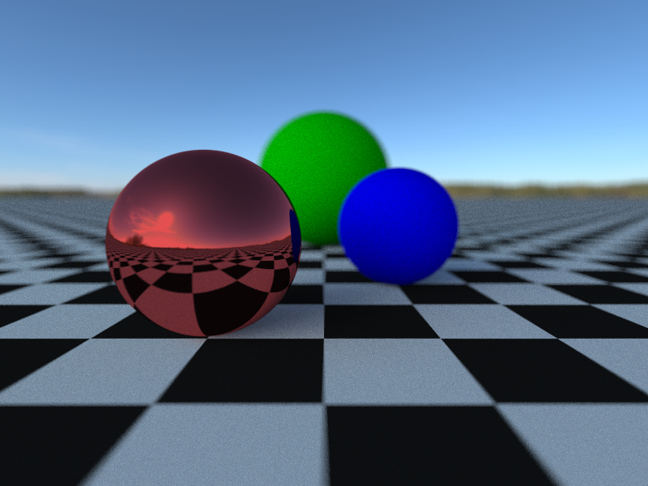

C-trace is a minimal raytracer written in (as the name might suggest) C. I began
work on it by following the well-known [raytracing in one
weekend](https://raytracing.github.io) book, but have implemented some unique
features of my own. The most minor of these is that I use libpng to output
compressed image data instead of the simple uncompressed format described in the
book. The others will be described in detail in the following sections.

## Scene Format

The biggest new feature I added was the ability to feed in scenes specified in
an external file and have the raytracer parse them, rather than having to
specify the scene in code and recompile the program every time a change was
made. I made the format myself rather than using an existing format so that it
would only support the set of features I had actually implemented, though for
future work on raytracing I have thought about using an existing scene standard
instead. An example scene specification is given below:[^1]

[^1]:please ignore the `data-lang: python` in the HTML if you're someone like me
who cares about tags being semantically correct. it was the only way I could get
hugo to highlight this properly

```python
camera
(0 0.6 2.5) # eye
(0 0.4 0.9) # look at
(0 1 0)     # up
90          # fov

background "./autumn_field_4k.hdr"

material diffuse checks 1.0 0.9 0.9 0.9 0.01 0.01 0.01
plane (0 1 0) 0

material specular 0.8 0.1 0.1
sphere (0.5 0.4 0.9) 0.4

material diffuse 0.0 0.0 0.8
sphere (-0.5 0.4 0) 0.4

material diffuse 0.0 0.5 0.0
sphere (0.0 0.8 -2) 0.8
```

which when rendered generates the following scene:

The scene description language was designed to be parsed with a very simple hand
coded parser and lexer, thought it could be easily translated to use a parser
generator of some sort. The lexer utilizes perfect hash tables generated with
[GNU gperf](https://www.gnu.org/software/gperf/) for keyword recognition, which
is definitely overkill considering that parsing of scene files takes up
a miniscule amount of time compared to raytracing and all my scene files are
quite small, but was very fun to implement. The lexer reads from a stream rather
than mapping the entire input into memory and working from there, which enables
the reading of scene descriptions from standard input and therefore easier
programmatic generation of scene descriptions.

## Sampling

My raytracer supports two improvements over the sampling techniques described in
the raytracing book. Firstly for anti-aliasing it uses a 
[Hammersley set](https://en.wikipedia.org/wiki/Low-discrepancy_sequence#Hammersley_set)
which is an improvement over the white noise sampling recommended in the book
since, although it isn't random, it evenly covers the field for any number of
samples and can always cover the field better by increasing the number of
samples. This sampling improvement applies within each pixel, but it could also
be extended (using a higher dimensional hammersley set to prevent correlation
issues) to apply to sampling the area of the sensor for creating depth of field
effects.

Secondly, my raytracer uses importance sampling to improve its environmental
lighting, preferentially sampling directions that contribute more light and
weighting them appropriately to cancel out the sampling bias. This leads to
a much less noisy image and to avoiding the problem where a small light source
with very high intensity (e.g. the sun in an environment map) doesn't contribute
as much as it should due to being undersampled.

## Future Work

The most pressing issue currently is the lack of any sort of actual tone mapper
for converting HDR colors to 24 bit RGB. For example, if I attempt to use the
full dynamic range of the environment map I was using for testing, every diffuse
surface becomes completely saturated because the amount of light coming from the
sun is massive. This doesn't match our real experience of the world because
human color perception isn't linear, so more complex tone mapping logic is
needed than simply clamping values to the 0-1 range as the program currently
does. There are well known systems for handling this kind of conversion between
color spaces such as [OpenColorIO](https://opencolorio.org/) which can implement
tone mapping solutions like AgX (the current standard in programs like Blender).

There is also the matter of expanding the range of objects that can be rendered
by the raytracer. Currently it only supports spheres and planes since they are
some of the easiest geometric primitives to implement but can be used to
construct scenes with enough visual interest to be useful for testing. However,
I would like to support arbitrary geometry described in some common 3d model
format. This would involve implementing acceleration structures and high
performance ray-triangle intersection methods, both of which I have investigated
but not actually implemented yet.

Finally, there are fundamental ways in which the sampling logic could be
improved, using techniques such as multiple importance sampling. This would be
important when attempting to simulate more complicated optical phenomena and
to properly support illumination other than environmental illumination.

I'd also like to work on reimplementing some of the concepts I've learned while
working on this in a rust based raytracer instead.
